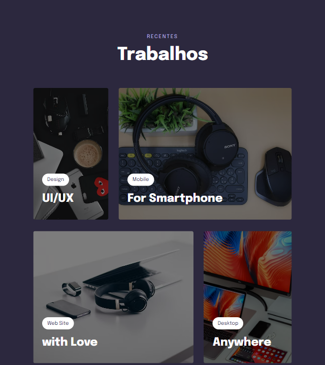
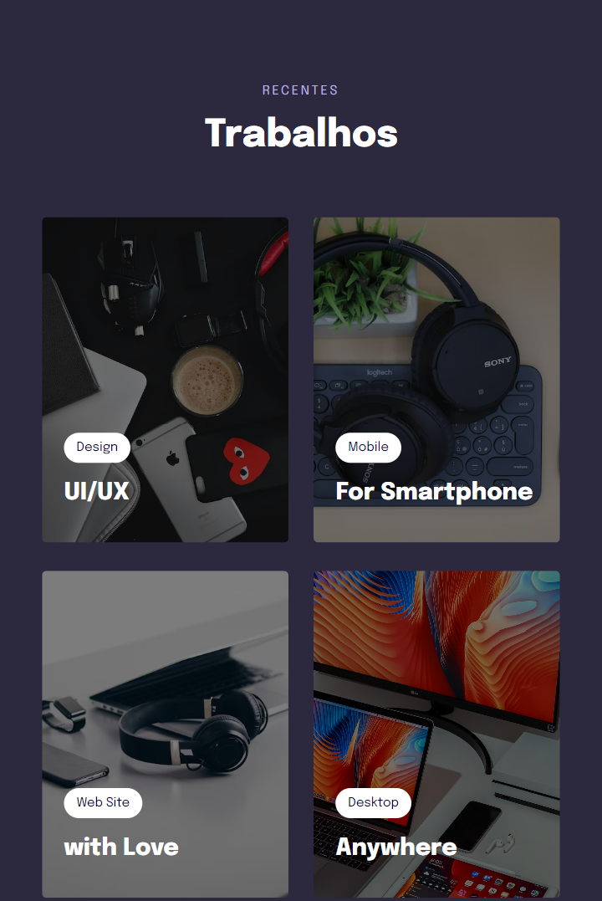
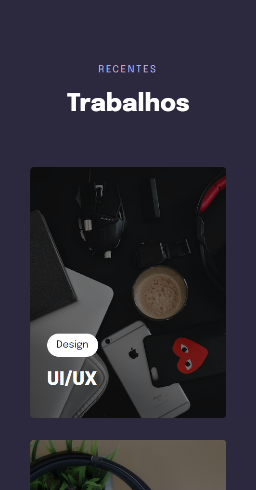

# Projeto 05: Componente Trabalhos

### Desktop

### Tablet

### Mobile

### Acesse o projeto: [Aqui](https://jonasncsantos.github.io/Crie-seu-evento/)

## Sobre
Projeto desenvolvido durante aula para aplicação dos conhecimentos ensinados no curso Explorer da [Rocketseat](https://www.rocketseat.com.br/) no Stage 03.

## Aprendizados
- Variaveis no CSS
- Cores em HSL 
- root 
- Tansições no CSS
- Transformações no CSS
- Animações com CSS
- Display Grid do CSS
- Filtro em imagens com CSS
- Clamp do CSS